
# Práctica: Editors

Autor: Ainoa Iglesias Dasilva - alu0101164403

## Objetivos
* Estudie y configure GitPod para trabajar con GitHub
* Instale VSCode en su máquina
* Siga los tutoriales de VSCode
* Instale el plugin Remote SSH y aprenda a usarlo
* Use Live Share para colaborar con un compañero
* Elabore un informe con la experiencia adquirida en el repositorio asignado

## Pasos seguidos
Esta práctica busca conocer y aprender GitPod y características de VSCode. VSCode es el editor de código que uso normalmente y herramientas como Remote SSH y Live Share ya las tenía instaladas y las he usado anteriormente.

* GitPod

  * Alta dada en Gitpod. Ahora se puede acceder desde el repositorio:

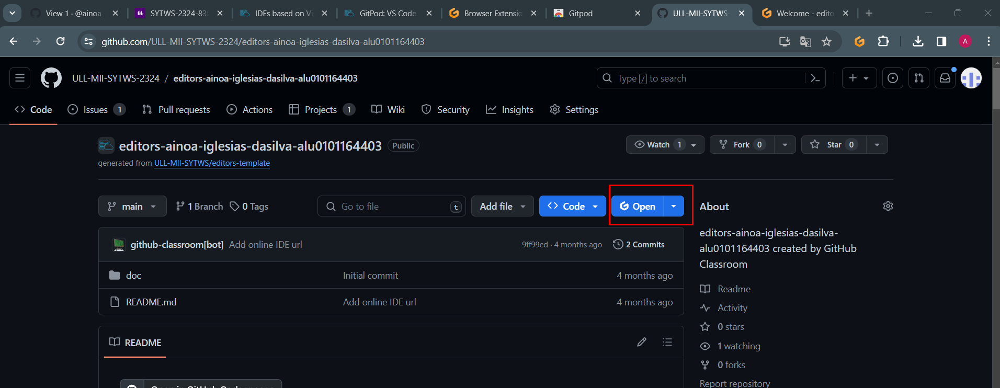

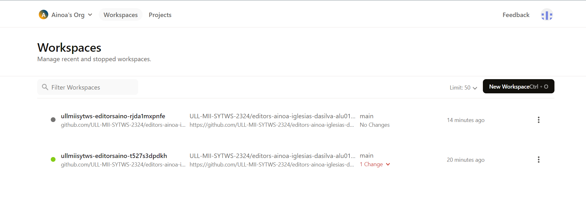

* Instalado botón gitpod en el browser:

  * He instalado la extensión de Chrome que permite utilizar el botón de GitPod, como se ve en la imagen.

  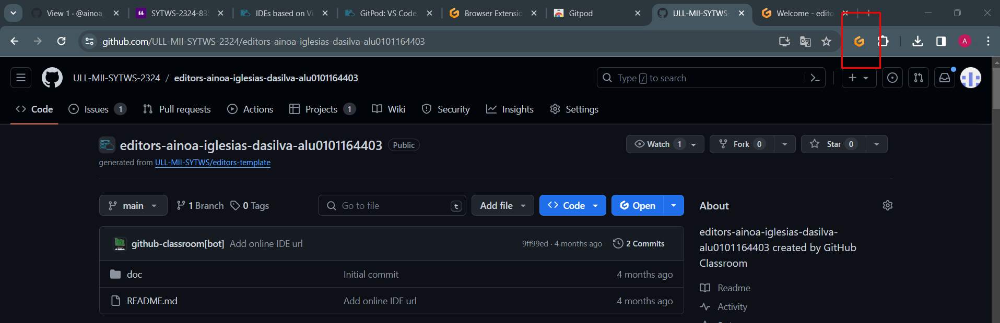

* He usado gitpod: Open in VSCode

  * Una vez abierto GitPod en el navegador, al seleccionar la opción "Open in VSCode" es posible abrir el GitPod en VSCode en la máquina local.

  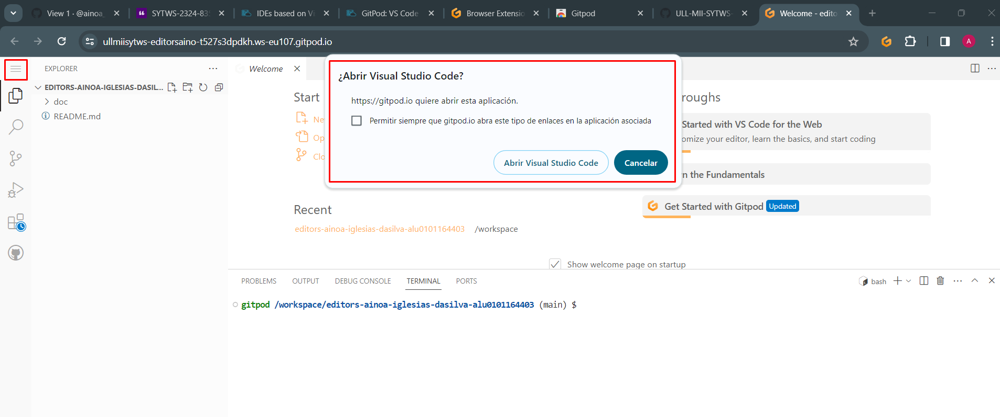

  * Por ejemplo, si se crea un archivo de prueba:

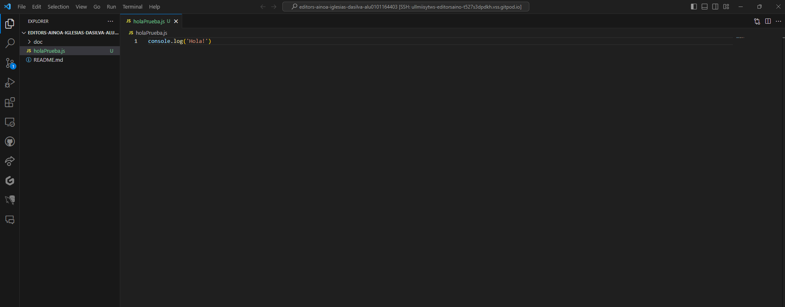

  * Los cambios se ven reflejados en la pestaña de GitPod en el navegador.

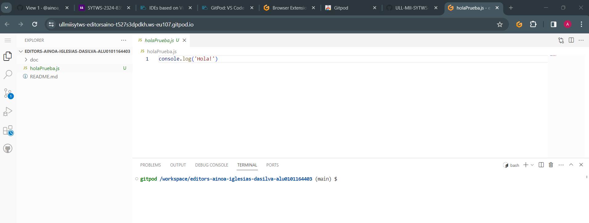

* Instalado SSH plugin para VSCode y funciona con máquina del iaas

  * Se ha instalado el plugin Remote-SSH.

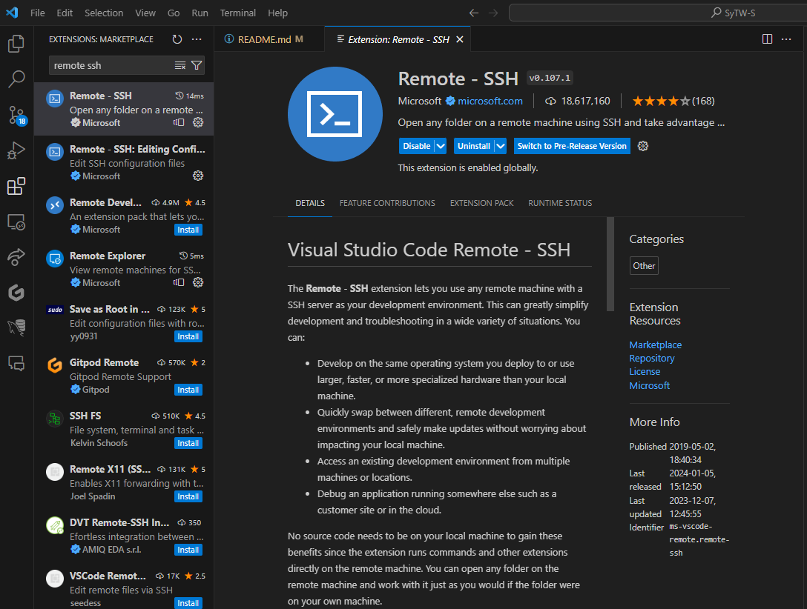

  * Una vez instalado, se ha probado con la máquina del IaaS, como se ve en la imagen. "PL" es un alias de la máquina.

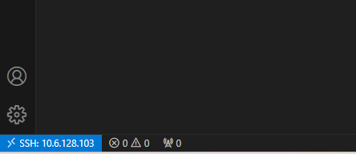

* LiveShare instalado y funcionando correctamente

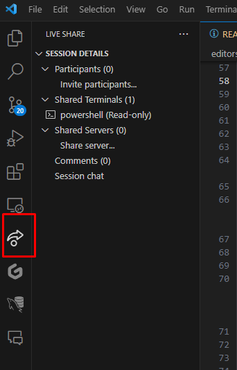

## Maneras de usar GitPod

* Botón del navegador que aparece tras instalar la extensión de chrome y botón en el repositorio de GitHub:

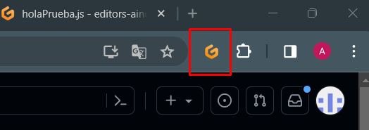

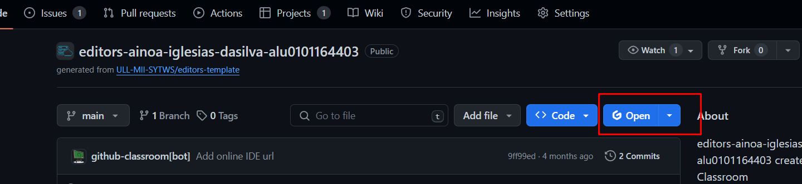

* VSCode abriendolo a através de la opción de Open in VsCode:

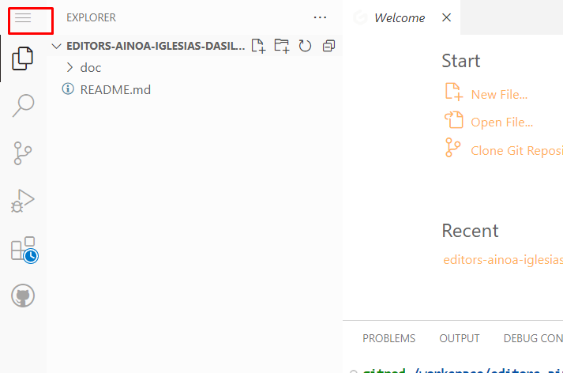
